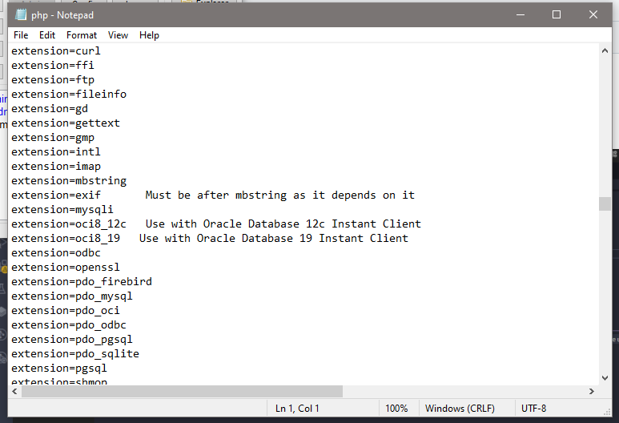
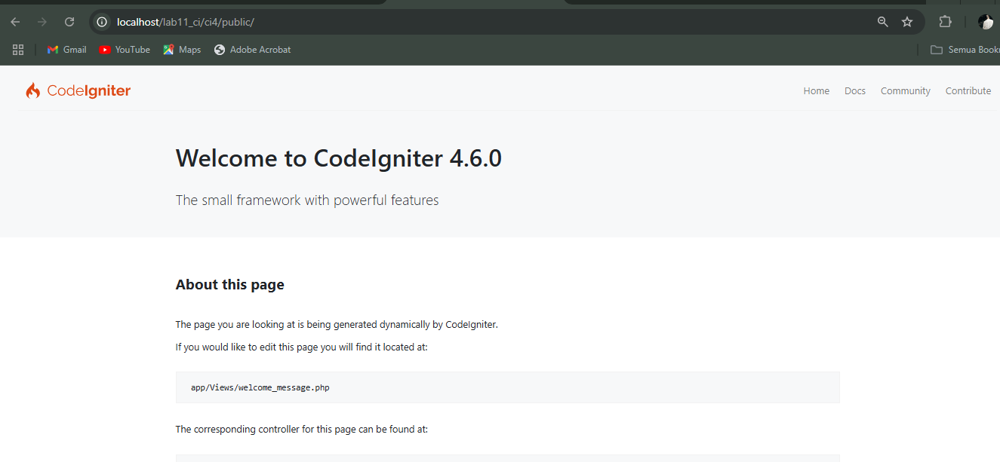
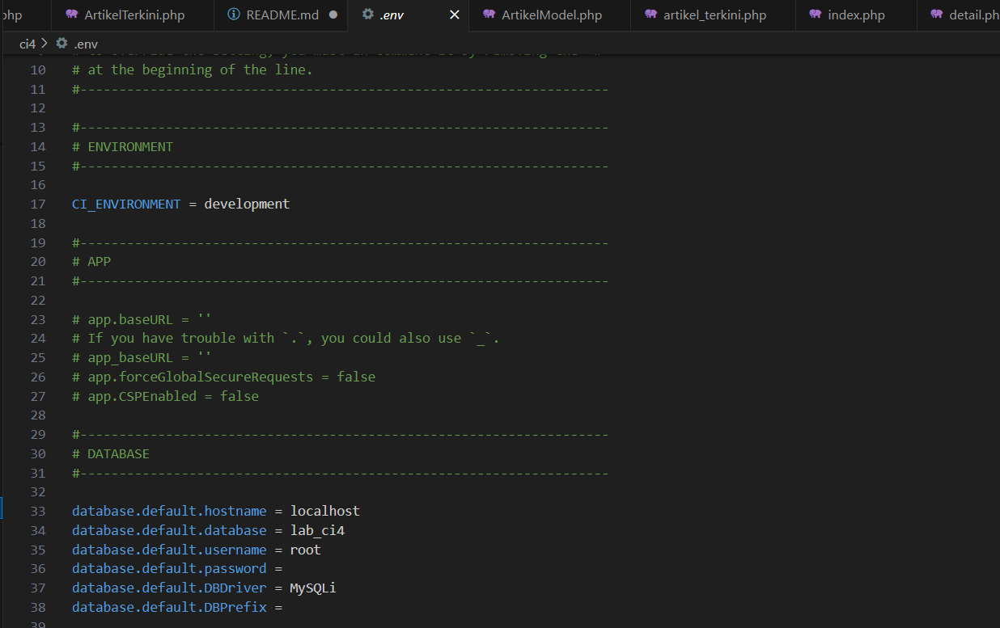
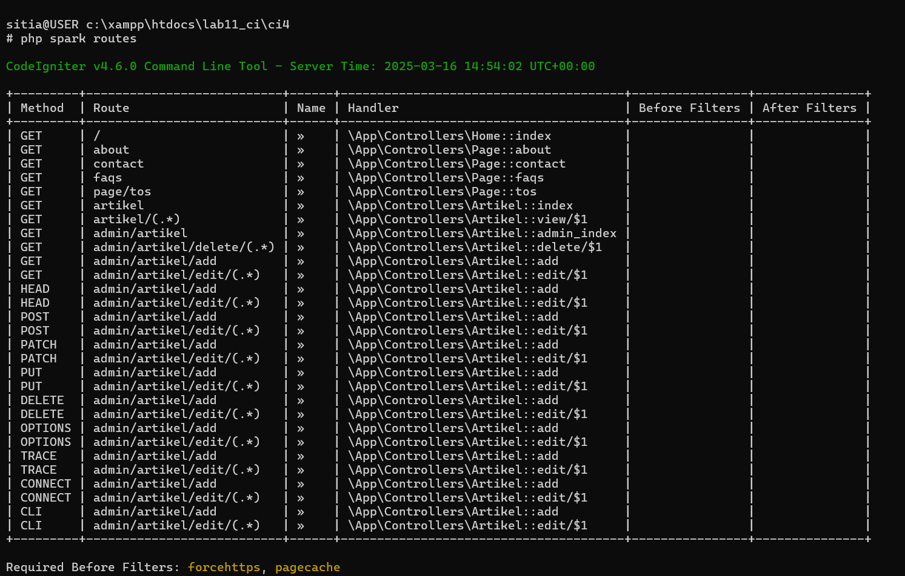
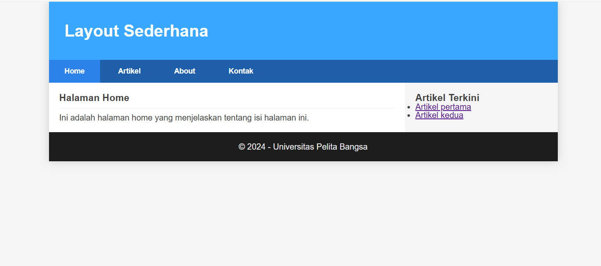
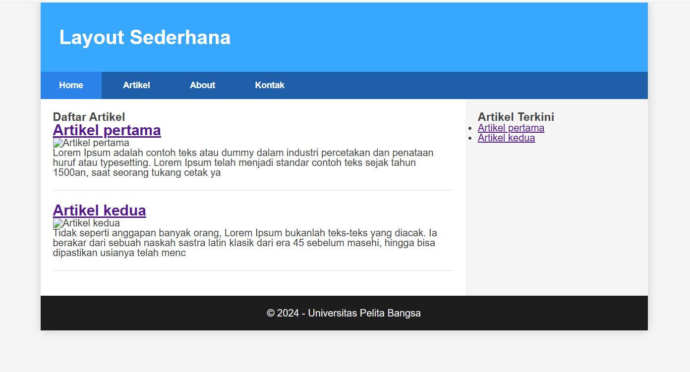
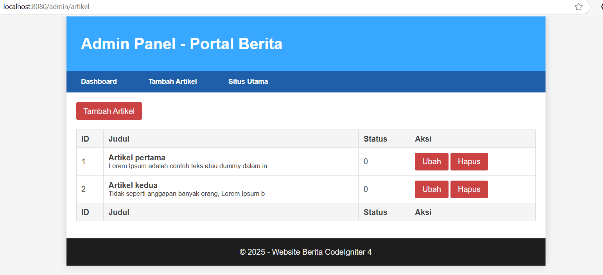
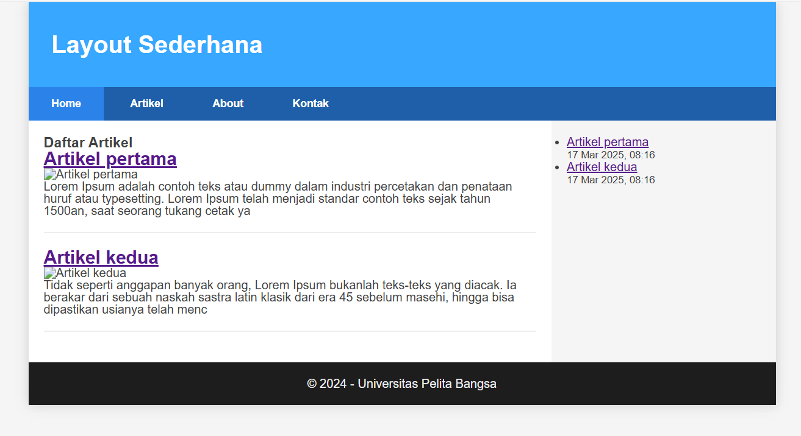
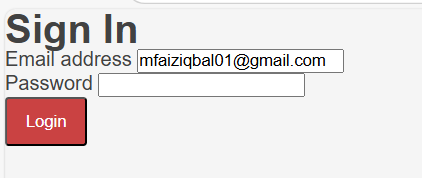

# Praktikum 1: PHP Framework (CodeIgniter 4)

## PROFIL

|  |  |
| -------- | --- |
| **Nama** | Muhammad Faiz Iqbal |
| **Kelas** | TI.23.A.5 |
| **Mata Kuliah** | Pemrograman Web 2 |
| **Dosen Pengampu** | Agung Nugroho S.kom, M.kom |
---

## Tujuan Praktikum

- Memahami konsep dasar Framework.
- Memahami konsep dasar MVC.
- Membuat program sederhana menggunakan Framework CodeIgniter 4.
- Mengimplementasikan routing dan controller pada CodeIgniter.
- Membuat tampilan dengan View dan Layout menggunakan CSS.

---

## Langkah-Langkah Praktikum

### 1. Persiapan

Mengaktifkan ekstensi PHP yang dibutuhkan melalui `php.ini`.
Restart Apache melalui XAMPP Control Panel.

**Screenshot Konfigurasi PHP.ini:**



---

### Instalasi Codeigniter 4

Download Codeigniter 4 dari [🔗 Situs Resmi Codeigniter](https://codeigniter.com/download).
Ekstrak ke direktori `htdocs/lab11_ci/`.
Ubah nama folder menjadi `ci4`.
Akses `http://localhost/lab11_ci/ci4/public/` untuk memastikan instalasi berhasil.

**Screenshot Tampilan Codeigniter 4:**



---

### Menjalankan CLI (Command Line Interface)

```bash
cd xampp/htdocs/lab11_ci/ci4/
php spark
```
---

### Mengaktifkan Mode Debugging

```bash
# Buka file .env dan ubah:
CI_ENVIRONMENT = development
```

📷 **Screenshot Konfigurasi Debugging:**



---

### Membuat Route Baru

Tambahkan kode berikut di `app/config/Routes.php`:

```php
$routes->get('/', 'Home::index');
$routes->get('/about', 'Page::about');
$routes->get('/contact', 'Page::contact');
$routes->get('/faqs', 'Page::faqs');
$routes->get('page/tos', 'Page::tos');

// Route untuk halaman publik artikel
$routes->get('/artikel', 'Artikel::index');
$routes->get('/artikel/(:any)', 'Artikel::view/$1');

// Route untuk admin dalam grup admin
$routes->group('admin', function($routes) {
    $routes->get('artikel', 'Artikel::admin_index');
    $routes->add('artikel/add', 'Artikel::add');
    $routes->add('artikel/edit/(:any)', 'Artikel::edit/$1');
    $routes->get('artikel/delete/(:any)', 'Artikel::delete/$1');
});

$routes->setAutoRoute(true);
```

```bash
php spark routes
```

**Screenshot CLI & Error Page:**


---

### 8. Membuat Layout Web dengan CSS

- Simpan file `style.css` di `public/`
- Buat `header.php` dan `footer.php` di `app/Views/template/`
- Ubah `about.php` agar menggunakan `include`:

```php
<?= $this->include('template/header'); ?>
<h1><?= $title; ?></h1>
<p><?= $content; ?></p>
<?= $this->include('template/footer'); ?>
```

**Screenshot :**


---

## 📄 Menambahkan Halaman Artikel

Karena di navigasi ada menu `Artikel`, kita juga harus membuat halamannya.

🛠 **Langkah 1: Menambahkan Route untuk Halaman Artikel**
Tambahkan kode berikut di `app/Config/Routes.php`:

```php
$routes->get('/artikel', 'Page::artikel');
```

📝 **Langkah 2: Membuat Method dalam Controller**
Tambahkan method `artikel()` di `app/Controllers/Page.php`:

```php
public function artikel() {
    return view('artikel', [
        'title' => '📰 Halaman Artikel',
        'content' => 'Selamat datang di halaman artikel. Di sini Anda dapat membaca berbagai artikel menarik yang kami sajikan.'
    ]);
}
```

🎨 **Langkah 3: Membuat View untuk Halaman Artikel**
Buat file baru `app/Views/artikel.php` dan isi dengan kode berikut:

```php
<?= $this->include('template/header'); ?>
<h1>📰 <?= $title; ?></h1>
<p>📖 <?= $content; ?></p>
<?= $this->include('template/footer'); ?>
```

🌐 **Langkah 4: Mengakses Halaman Artikel**
Setelah semua selesai, buka browser dan akses:

```
http://localhost:8080/artikel
```

Jika semua sudah berjalan dengan baik, halaman `Artikel` akan tampil dengan kontennya. 🎉

📷 **Screenshot Tampilan Halaman Artikel:**

---

## Membuat Database
```php
CREATE DATABASE lab_ci4;
```
## Membuat Tabel
```php
CREATE TABLE artikel (
id INT(11) auto_increment,
judul VARCHAR(200) NOT NULL,
isi TEXT,
gambar VARCHAR(200),
status TINYINT(1) DEFAULT 0,
slug VARCHAR(200),
PRIMARY KEY(id)
);
```
---

## Membuat Menu Admin
Menu admin adalah untuk proses CRUD data artikel. Buat method baru pada Controller
Artikel dengan nama admin_index().

**Screenshot :**

---

## View Layout dan View Cell
**Screenshot :**

---
## Pertanyaan dan Tugas
* Sesuaikan data dengan praktikum sebelumnya, perlu melakukan perubahan field pada
database dengan menambahkan tanggal agar dapat mengambil data artikel terbaru.
* Selesaikan programnya sesuai Langkah-langkah yang ada. Anda boleh melakukan
improvisasi.
* Apa manfaat utama dari penggunaan View Layout dalam pengembangan aplikasi?
* Jelaskan perbedaan antara View Cell dan View biasa.
* Ubah View Cell agar hanya menampilkan post dengan kategori tertentu.
---

## 1. Menambahkan tanggal pada database
    Anda perlu menyesuaikan struktur database dengan menambahkan field tanggal (misalnya created_at atau published_at dengan tipe DATETIME atau TIMESTAMP).
## 2. Menyelesaikan program sesuai langkah-langkah dengan improvisasi
Anda bisa mengikuti langkah-langkah yang ada, tetapi juga menambahkan fitur seperti:

    Pencarian artikel berdasarkan kategori atau tanggal.
    Menampilkan jumlah artikel terbaru di halaman utama.
    Pagination untuk membatasi jumlah artikel yang ditampilkan.
## 3. Manfaat utama dari penggunaan View Layout dalam pengembangan aplikasi
    View Layout memungkinkan Anda membuat struktur tampilan yang konsisten di seluruh aplikasi.
    Mempermudah pemeliharaan karena perubahan di satu tempat (layout) bisa berdampak ke semua halaman.
    Mengurangi duplikasi kode, sehingga lebih efisien dan bersih.
## 4. Perbedaan antara View Cell dan View biasa
**View Biasa:** Menampilkan tampilan HTML secara langsung dengan data yang diberikan. Biasanya digunakan untuk tampilan utama yang statis.

**View Cell:** Digunakan untuk membuat komponen tampilan yang lebih modular dan reusable. Misalnya, daftar artikel populer yang bisa dipanggil di berbagai tempat dalam aplikasi.
## 5. Mengubah View Cell agar hanya menampilkan post dengan kategori tertentu
```php
public function latestPosts($kategori)
{
    $model = new ArtikelModel();
    $data['posts'] = $model->where('kategori', $kategori)->orderBy('tanggal', 'desc')->findAll(5);

    return view('components/latest_posts', $data);
}
```
---

## Membuat Login



## SELESAI  

- Email: mfaiziqbal01@gmail.com

 